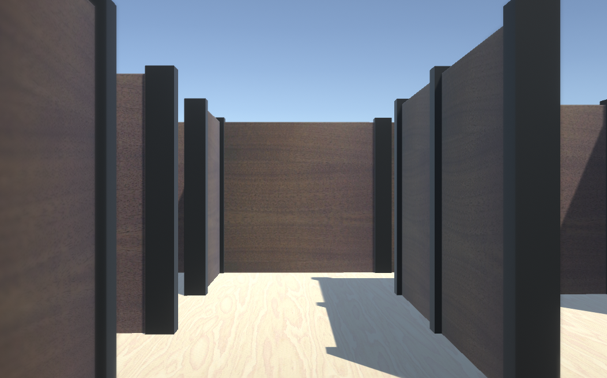
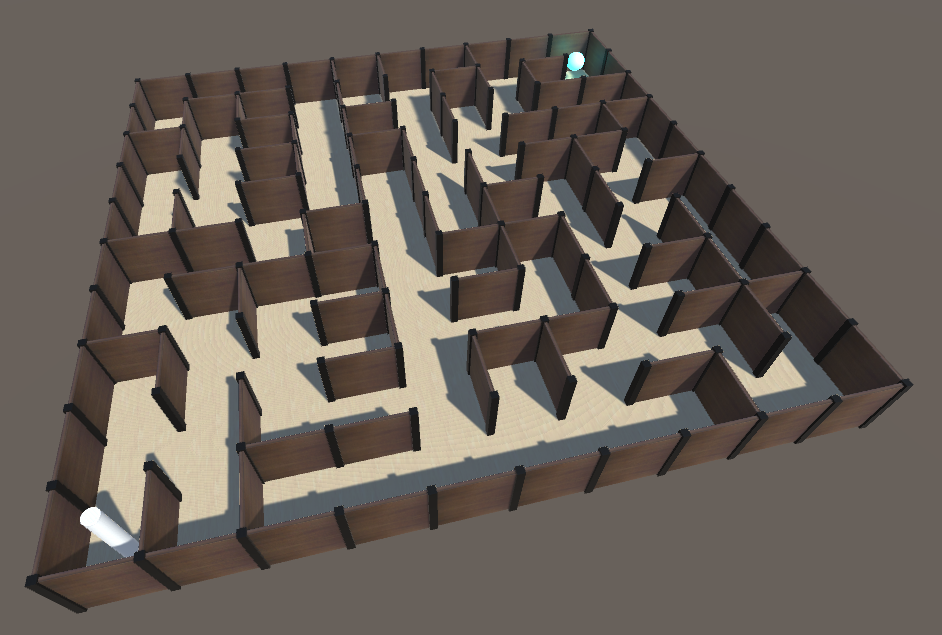

# Maze
A maze game made by using the libMaze library in my repository.  

## How to play
You can play by keyboard for now.  

- W: move forward  
- S: move back  
- A: move left  
- D: move right  
- Right arrow: rotate right  
- Left arrow: rotate left  
- Space: jump  
- Return: Player view / Bird's eye view (for debug)  

## Screenshot

(Player view)  
  

(Bird's eye view)  
  
